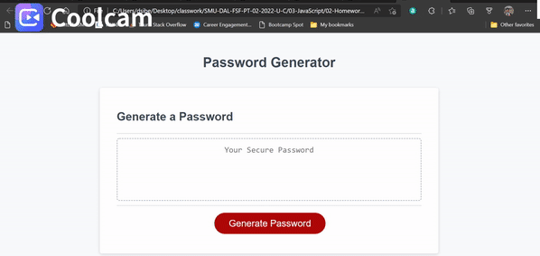

# 03 JavaScript: Password Generator

## Expectation

This week’s homework requires you to modify starter code to create an application that enables employees to generate random passwords based on criteria that they’ve selected. This app will run in the browser and will feature dynamically updated HTML and CSS powered by JavaScript code that you write. It will have a clean and polished, responsive user interface that adapts to multiple screen sizes.

The password can include special characters. If you’re unfamiliar with these, see this [list of password special characters](https://www.owasp.org/index.php/Password_special_characters) from the OWASP Foundation.

## User Story

```
AS AN employee with access to sensitive data
I WANT to randomly generate a password that meets certain criteria
SO THAT I can create a strong password that provides greater security
```

## My Task

Given the user story, it was made to seccessfuly generate a secured password that
provides a greater security by using a series of prompts per users criteria. Users 
are asked a series of prompts to narrow their preference. They are asked Prompts 
such as: How long they want their password to be, if they want to include 
uppercase/lowercase, numeric and special characters. After all prompts are answered, 
the answers will be validated and then password is generated that matches the selected 
criteria. When password is generated, it will be displayed written to the page.  

``


## Mock-Up


The following image shows the web application's appearance and functionality:


